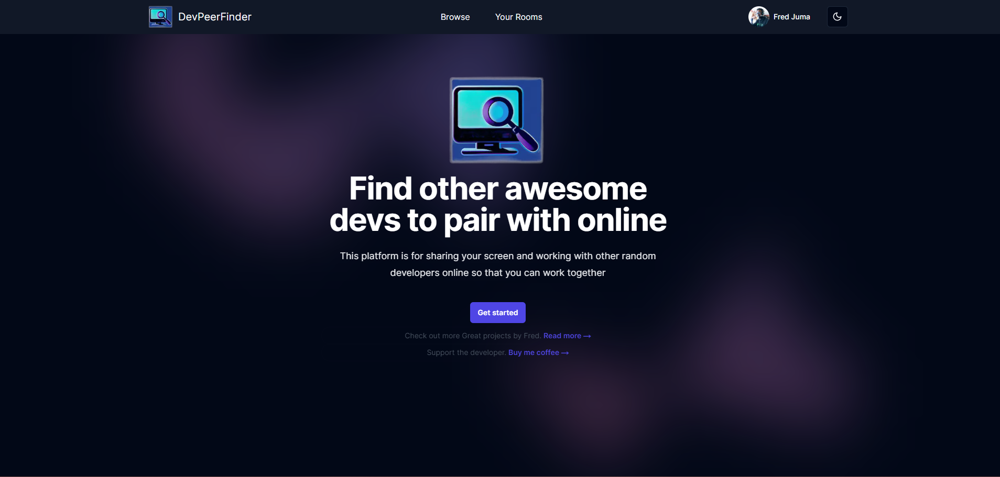
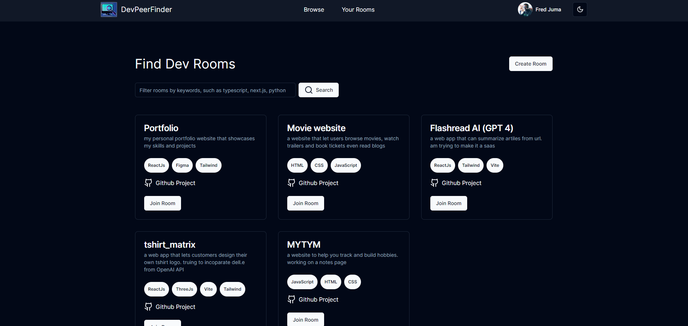
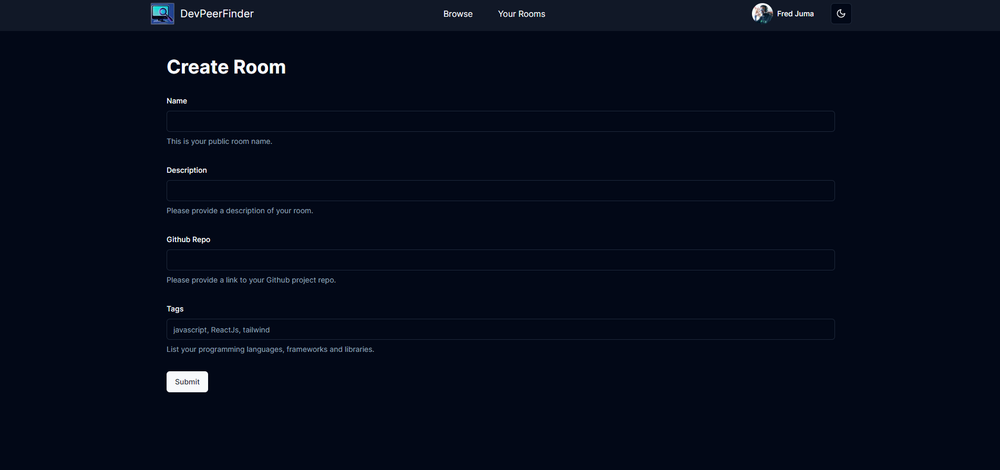
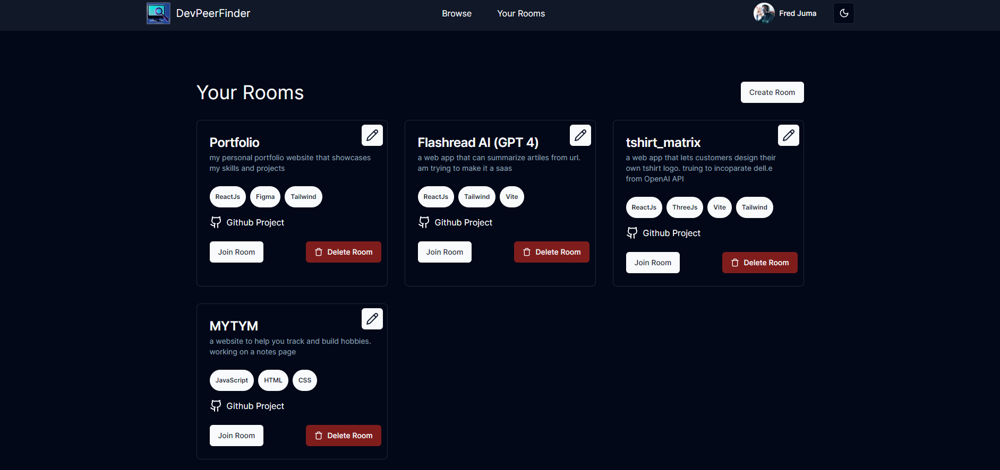
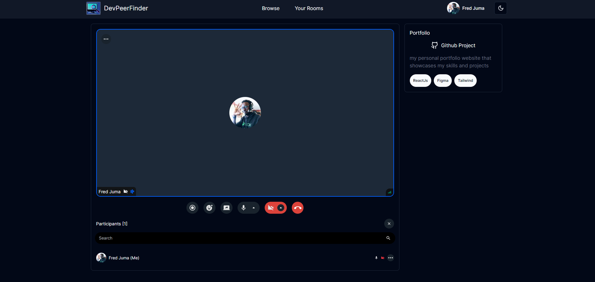

<link
  rel="stylesheet"
  href="https://cdn.jsdelivr.net/gh/dheereshagrwal/colored-icons@1.7.5/src/app/ci.min.css"
/>

Welcome to DevPeerFinder!
A website that helps developers find other developers to collaborate with on projects.
You can share your screen and code with others in real-time, and chat with them as well.

## Features
- Video chat
- Screen sharing
- Code sharing via github links
- Create and join rooms
- Manage your created rooms (delete, edit)

## Tech Stack

<code></code>
<code></code>
	<code></code>
	<code></code>
	<code></code>

- next-auth (google cloud)
- getstream.io (chat) API
- shadcn (UI library)

## Screenshots

THE INTERFACE ⬇️⬇️⬇️

